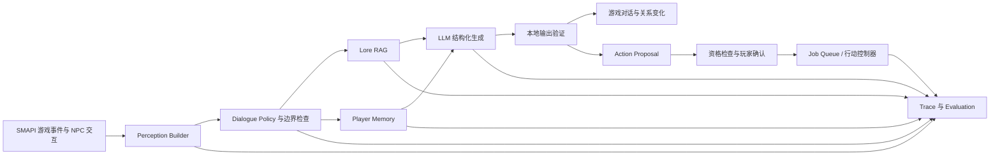

# Valewake

Valewake 是一个面向《星露谷物语》的 AI NPC Mod，也是一套可评估、可追踪的游戏智能体原型。它通过 SMAPI 接入原版 NPC 交互，让 NPC 能基于角色设定、有限游戏感知、玩家记忆和关系状态进行连续对话，并在本地规则约束与玩家确认后执行有限任务。

项目当前版本为 `1.0.0`。核心目标不是只给 NPC 接一个聊天 API，而是把“感知、检索、记忆、策略、生成、验证、行动和评估”连成一条可解释的完整链路。

## 核心能力

- 支持全部原版社交 NPC；Mod NPC 使用受限的通用角色回退配置。
- 默认保留 NPC 当天首次原版对话，随后可通过右键进入连续 AI 对话。
- 使用 NPC 有限视野构造上下文，避免角色无条件得知玩家整个农场或远处事件。
- 按存档和 NPC 隔离玩家记忆，包含会话、情节、语义检索和长期画像四层。
- 使用 JSONL Lore、主题路由、BM25、字符 n-gram TF-IDF 与父级上下文进行混合检索。
- 将 AI 关系判断同时映射到原版好感度以及 Valewake 的 Rapport/Trust。
- 使用原版肖像表情展示经过验证的 NPC 情绪。
- 支持 Prompt Injection、身份覆盖、策略绕过和系统信息泄露检测。
- 记录每轮检索、生成、关系、记忆和行动决策 Trace，可在游戏中人工标注并导出 JSONL。

## 行动能力

NPC 不会直接执行 LLM 输出。模型只生成结构化提案，提案还要经过本地资格检查、参数归一化、玩家确认和确定性控制器，才能进入任务队列。

当前可执行能力包括：

- 农场浇水。
- 清除杂草。
- 有界砍树，默认最多处理 `3` 棵成熟且未安装树液采集器的农场树木。
- 跨地图派工、离屏继续工作、日程占用与恢复、失败恢复。
- 矿洞同行、跨地图与换层跟随。
- 防御玩家，只攻击附近敌对怪物。
- 光标指定矿石、附近采矿和资源偏好探险。
- 未来时间与地点的约见提案。

农场任务默认要求 NPC 至少 `2` 心，矿洞同行默认要求至少 `4` 心。年龄、关系、信任、时间、事件状态、多人模式主机权限以及功能开关都是不可通过反复请求绕过的硬条件。对于满足硬条件但被 NPC 主观拒绝的同类请求，默认第 `3` 次会接受。

## 系统架构



仓库中的两个主要组件：

- `Valewake/`：C# SMAPI Mod，负责游戏接入、界面、状态感知、本地验证和动作执行。
- `backend/`：独立 FastAPI 后端，负责角色提示词、记忆、Lore 检索、对话策略、模型调用和 Trace。

发行包会附带单文件后端。SMAPI 加载 Mod 后会自动检查 `127.0.0.1:8010`，需要时隐藏启动 `Backend/ValewakeBackend.exe`，退出游戏时再关闭由本 Mod 启动的进程。普通玩家不需要手动启动 Python 或端口。

## 安装

### 普通玩家

1. 安装《星露谷物语》1.6 和 [SMAPI 4.0 或更高版本](https://smapi.io/)。
2. 从 [GitHub Releases](https://github.com/SimonWangsss/Valewake/releases) 下载 Valewake 的 Mod 压缩包，不要下载 GitHub 自动生成的 `Source code` 压缩包。
3. 解压到游戏的 `Mods` 目录，最终结构应为：

```text
Stardew Valley/
└─ Mods/
   └─ Valewake/
      ├─ manifest.json
      ├─ Valewake.dll
      ├─ config.json
      ├─ Backend/
      └─ data/
```

4. 配置模型 API，然后通过 SMAPI 启动游戏。

### 配置模型

推荐安装可选 Mod [Generic Mod Config Menu](https://www.nexusmods.com/stardewvalley/mods/5098)，在游戏设置中选择服务商、填写 API Key 和模型名。也可以退出游戏后直接编辑：

```text
Stardew Valley/Mods/Valewake/config.json
```

默认配置使用 DeepSeek：

```json
{
  "LlmProvider": "deepseek",
  "LlmApiKey": "你的 API Key",
  "LlmModel": "deepseek-v4-flash",
  "LlmApiBase": ""
}
```

当前内置服务商配置包括 DeepSeek、OpenAI、Anthropic Claude、通义千问、Google Gemini、OpenRouter，以及兼容 OpenAI 接口的自定义或本地服务。模型名称和账号额度由对应服务商决定。

也可以在 SMAPI 控制台输入 `agent_setkey <api-key>` 快速写入密钥。该方式可能让输入内容出现在本机控制台历史中，因此共享日志或录屏前请检查敏感信息。不要提交包含真实密钥的 `config.json`。

## 游戏内使用

靠近任意受支持的社交 NPC，右键完成当天首次原版对话；原版文本结束后再次右键，即可打开 Valewake 输入框并连续交谈。

可以直接用自然语言提出任务，例如：

```text
你能帮我给农场的作物浇水吗？
能帮我清理农场里的杂草吗？
陪我下矿，优先找铁矿。
保护我，帮我打附近的怪物。
明天傍晚六点在海边见面吧。
```

通过本地规则验证的行动提案会弹出原生 Yes/No 确认框。接受后，农场任务进入持久 Job Queue；矿洞请求进入同一次连续探险，由本地控制器负责跟随、战斗和采矿。矿洞探险中可将鼠标放在可开采节点附近并按 `G`，将其设为优先目标。

常用 SMAPI 控制台命令：

| 命令 | 用途 |
|---|---|
| `agent_state` | 输出当前游戏状态与 NPC 感知快照 |
| `agent_chat <内容>` | 与附近 NPC 对话的控制台备用入口 |
| `agent_jobs` | 查看活动中的农场任务 |
| `agent_cancel_jobs` | 取消所有任务并恢复 NPC 日程 |
| `agent_expedition` | 查看当前矿洞探险状态 |
| `agent_end_expedition` | 结束探险并让 NPC 进入返程 |
| `agent_mine_target` | 将光标所在位置设为优先采矿目标 |
| `agent_mark <标签> [备注]` | 标注最近一轮 AI 交互 |
| `agent_setkey <密钥>` | 写入并同步模型 API Key |

可用标注标签：`keep`、`reject`、`boundary`、`memory_good`、`memory_bad`、`action_good`、`action_bad`。

更完整的任务限制与结束条件见 [docs/action_catalog.md](docs/action_catalog.md)。

## 数据与隐私

- 对话记忆按存档与 NPC 隔离，保存在本机 Mod 数据目录中。
- Trace 会记录模型输入链路、检索结果、记忆变化、关系判断、Action Proposal、执行结果和延迟信息。
- 存档保存时提交本次会话数据；未保存退出时会记录 rollback 边界，避免把未发生的游戏进度当作已提交事实。
- `agent_mark` 可给最近一轮添加人工标签，供后续筛选真实对话数据集。
- 仓库 `.gitignore` 已排除 API 密钥、运行时记忆、Trace、Python 环境和构建产物。

游戏记录字段、存档提交语义与导出方式见 [docs/playtest_dataset.md](docs/playtest_dataset.md)。

## 开发与构建

开发环境需要 .NET SDK 6 或兼容 SDK、Python，以及已经安装 SMAPI 的《星露谷物语》。本机游戏路径在 `Valewake/Valewake.csproj` 的 `GamePath` 中配置。

仅构建 C# Mod：

```powershell
cd E:\Codex\ai-npc-3d-persona-memory\projects\Valewake\Valewake
dotnet build Valewake.csproj
```

从仓库根目录执行完整发行构建：

```powershell
powershell -NoProfile -ExecutionPolicy Bypass -File .\scripts\package_mod.ps1
```

该脚本会重新构建单文件后端、同步角色与 RAG 数据、构建 Release 版 Mod、部署到已配置的 `Mods` 目录，并生成可发布的 ZIP。

## 使用文档

- [任务能力、限制与结束条件](docs/action_catalog.md)
- [Playtest JSONL 字段与导出命令](docs/playtest_dataset.md)

## 参考与边界

本项目研究了 ValleyTalk、StardewGPT、stardew-mcp、SMAPI，以及游戏 Agent 领域的相关项目。参考内容用于理解 SMAPI 生命周期、对话接入方式、状态抽象和任务控制思路；Valewake 的记忆、检索、边界策略、评估链路与行动控制器均在本仓库中独立实现。第三方参考仓库不随本项目分发。
