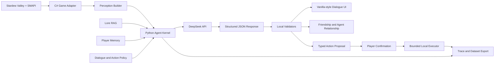

# Valewake 项目对话与开发总结

> 更新时间：2026-08-10
>
> 当前版本：0.10.0
>
> 项目目录：`E:\Codex\ai-npc-3d-persona-memory\projects\Valewake`
>
> GitHub：`https://github.com/SimonWangsss/Valewake`

## 1. 项目从哪里开始

项目最初是一个 Unity 3D AI NPC 原型：

- 使用 Unity 2022.3.16f1、VRoid/VRM10 角色和 LLMUnity。
- 目标是制作具有 Persona、Lore RAG、玩家记忆和游戏式对话 UI 的 AI NPC Demo。
- 早期内容以《愚公移山》为主线，NPC 为愚衡，设计了移山工地、族人营地和封石等场景。
- Unity Demo 已经完成远程 LLM、VRM 加载、基础场景、Windows 构建和独立 FastAPI 后端雏形。

后来项目方向转向 Stardew Valley。主要原因是星露谷已经提供了成熟、持续变化的游戏世界，能够更真实地展示 AI NPC 的状态感知、记忆、关系和行动能力，也比自制短流程 Demo 更适合作为求职项目。

Valewake 与愚公移山项目已经完全分离。它拥有独立的目录、后端包、RAG 数据、Memory、Prompt、测试集和 Git 仓库，不依赖原 Unity 项目运行。

## 2. 当前项目目的

Valewake 不是单纯的“给 NPC 接一个聊天 API”，而是一个面向 Stardew Valley 的、具有明确权限边界的 AI NPC Agent Framework。

当前目标分为两层：

1. 对话层：NPC 能结合角色设定、有限游戏感知、长期记忆和关系状态进行连续对话。
2. 行动层：NPC 能从自然语言中形成高层任务提案，经本地规则验证和玩家确认后，执行有限、可追踪、可恢复的游戏行为。

项目希望展示的核心能力包括：

- Perception Builder：把游戏状态转成 NPC 可以合理知道的上下文。
- Lore RAG：检索角色和世界背景，降低人物设定漂移。
- Player Memory：跨天、跨会话记住玩家相关事实，并与存档和 NPC 隔离。
- Dialogue Policy：限制越狱、提示泄露、越界知识、关系变化和动作权限。
- Evaluation & Trace：记录每轮决策来源，并用黄金集和真实游玩数据评估。
- Bounded Action Agent：让 LLM 只提出高层意图，由确定性本地执行器操作游戏。

## 3. 参考工作与借鉴边界

开发过程中调研和克隆了以下项目：

- ValleyTalk：重点参考 NPC 对话 Hook、玩家文字输入、候选回复和肖像表情体验。
- StardewGPT：参考 Stardew NPC 接入外部 LLM 的基础思路。
- stardew-mcp：参考将游戏状态抽象为资源、工具和动作的方式。
- SMAPI：参考事件生命周期、控制台命令、存档数据和 Mod 部署方式。
- The Stardew Squad：参考 NPC 同行、矿洞兼容、任务优先级和动作表现问题。

Valewake 采用“借壳不借脑”的原则：可以学习交互和兼容经验，但 Dialogue Kernel、Memory、RAG、Policy、Trace、关系授权和行动执行器均独立实现，不复制其他 Mod 的核心源码或完整 Prompt。

项目不应声称发明了 RAG、BM25、长期记忆或 Guardrails。更准确的工程贡献是：把这些模块与 Stardew 的存档语义、原版关系系统、NPC 日程和受限动作执行结合起来，并建立可复现的评估链路。

## 4. 当前总体架构



运行时由 SMAPI Mod 自动拉起随 Mod 部署的后端 EXE。后端监听 `127.0.0.1:8010`，负责调用 DeepSeek、检索 Lore 和 Memory、应用策略并记录 Trace。端口是 C# 游戏层与 Python Agent Kernel 的本地通信接口，不是远程模型服务器本身。

## 5. 对话系统进度

### 5.1 游戏内接入

当前已经支持所有可社交 NPC，不再只针对 Abigail：

- 默认保留当天第一次原版对话，以维持原版每日交谈、好感和事件语义。
- 原版文本结束后可打开连续 LLM 对话。
- 支持右键交互和文字输入窗口。
- 修正了标题越出输入框的问题，并允许原版对话结束后重新打开 AI 对话。
- 模型输出为结构化 JSON，本地只展示 `reply`，防止 JSON 字段泄露到对话框。
- 支持情绪字段到 Stardew NPC 肖像表情的映射。
- ValleyTalk 应关闭，避免两个 Mod 同时 Hook NPC 对话。

### 5.2 角色管理

- `stardew_npcs.json` 提供多 NPC Persona Registry。
- Prompt 注入 NPC 身份、说话风格、关系阶段、可见事实、Lore 和 Memory。
- Abigail 的专属 Lore 最丰富；其他 NPC 已能接入，但专属知识深度仍不均衡。
- NPC 不应凭完整 Agent Snapshot 获得全知视角，Prompt 使用经过裁剪的 NPC Perception。

### 5.3 原版关系与 AI 关系

Valewake 同时维护两类关系：

- 原版 Friendship：直接接入 Stardew 的好感点，250 点约等于一颗心。
- Agent Relationship：Rapport、Trust 等用于对话策略和行动授权。

默认 AI 好感规则：

- 关系判断置信度至少为 0.72。
- 必须引用玩家原话中的有效证据。
- 普通变化为 5 点，强烈变化为 10 点。
- 每天最多增加 10 点、降低 10 点。
- 默认 HUD 只显示模糊提示，不显示具体数字。

动作权限还会检查心数、Trust、置信度、地点、时间和目标白名单，而不是只听从 LLM 的同意文本。

## 6. 五个核心 AI 模块

### 6.1 Perception Builder

已经采集并组织：

- 季节、日期、时间、天气和当前位置。
- 玩家金钱、体力、背包和基础农场状态。
- 附近 NPC、对象、作物和有限范围内可交互目标。
- 当前 NPC、原版好感、Agent Relationship 和活动任务。

系统区分完整调试快照与 NPC 可见快照。NPC 对话只使用有限感知，避免角色知道远处农场、未发生事件或其他存档的信息。

当前不足：感知权限仍主要依赖规则裁剪，缺少更细的听觉、遮挡、事件传播和“他人转述”模型。

### 6.2 Lore RAG System

Lore 表示固定的角色背景、兴趣、关系、城镇常识、游戏世界规则和 Agent 能力边界；它不同于玩家 Memory。

当前实现：

- JSONL 知识块。
- NPC、主题和场景标签路由。
- BM25 词法召回。
- 中英文字符 n-gram TF-IDF 稀疏向量余弦相似度。
- 关键词、短语、标签奖励和 parent context。
- 检索结果及分数写入 Trace，便于解释“为什么拿到这条知识”。

当前没有外部向量数据库，也不调用 embedding API。现有轻量混合检索适合当前知识库规模，但对复杂释义和跨语言语义召回仍有限。

主要不足：

- 多 NPC Lore 覆盖不均，Abigail 明显更完整。
- 需要按 Persona、关系、地点、节日、剧情和行动能力继续扩充黄金问题。
- 后续应先测 Recall@K 和 nDCG，再决定是否增加 embedding reranker，而不是为了技术流行度直接换数据库。

### 6.3 Player Memory System

Memory 已经具备自动沉淀，不只是把聊天历史原样保存。当前分为四层：

1. Conversation Memory：C# 会话内最近消息，默认最多 12 条。
2. Episodic Memory：保存某天某 NPC 与玩家发生的具体互动。
3. Semantic Memory：从对话中提炼玩家偏好、观点、承诺和稳定事实。
4. Durable Profile：多次确认后强化的长期玩家档案。

写入流程包括：

- 模型最多提出 3 条结构化 Memory Candidate。
- 本地检查证据、类别、稳定性、问题句、越界轮次和重复项。
- 近义或相同事实通过 canonical key 去重并增加重复确认次数。
- 检索综合文本相关性、记忆类型、重要度、重复次数和游戏日衰减。
- Memory 按“存档 + NPC”隔离，不应跨存档或跨 NPC 串线。

已经加入存档语义：

- 游戏保存时触发 Memory commit/checkpoint。
- 未保存退出时触发 rollback，避免聊天已经写盘但游戏进度没有保存。
- Trace 记录 save commit/rollback 边界。

主要不足：

- 尚无完整 reflection 和周期性摘要。
- 近义事实未使用 embedding 聚类。
- 矛盾记忆的替换、并存和时间版本管理仍较基础。
- 缺少面向真实长期游玩的 Memory precision、recall 和 contradiction 指标。

### 6.4 Dialogue Policy / Boundary Control

当前边界控制不是只靠一段 Persona Prompt，而是多层组合：

- Prompt 层：明确角色身份、世界边界、知识来源和输出 Schema。
- 语义分类层：识别身份覆盖、秘密提取、策略绕过和游戏外诱导。
- 多轮上下文层：识别拆分攻击和前后轮组合越狱。
- 输出检查层：拦截中英文模型身份、系统提示、开发者消息和后台信息泄露。
- 副作用隔离层：越界轮次禁止写 Memory、增加好感或产生 Action Proposal。
- 证据层：关系变化和长期 Memory 必须引用玩家原话。

已建立 60 条越狱黄金集并进行新旧版消融对比。这个结果适合展示安全策略改进，但 60 条仍是小规模、设计内测试，不能等同于开放世界攻击分布上的真实安全准确率。

主要不足：需要继续收集真实玩家误杀、隐晦攻击、方言、错别字和长上下文样本，并区分攻击召回率与正常对话误杀率。

### 6.5 Evaluation & Trace System

每轮对话会记录：

- session、save、NPC、game day 和 turn ID。
- 玩家输入、有限感知摘要和策略分类。
- 检索到的 Lore 与 Memory。
- 模型结构化输出、最终展示文本和情绪。
- 好感变化、Memory 写入和 Action Proposal。
- Action Job/Expedition 的接受、执行、完成、跳过和失败原因。

已实现：

- `agent_mark`：在真实游玩时标注好/坏对话、Memory 或 Action。
- save commit/rollback 事件。
- Dialogue Trace 与 Action Trace 关联。
- JSONL 数据集导出器。
- 离线黄金集、真实 Trace scorer 和新旧安全策略消融目录。

当前自动验证结果：

- C# 构建：0 warning / 0 error。
- Python 测试：40/40。
- 动作意图黄金集：53/53。
- 动作 Exact Intent Accuracy：1.0。
- 动作 Macro F1：1.0。
- 动作 proposal contract rate：1.0。

这些结果证明确定性规则和当前黄金集一致，不代表真实玩家表达、实时寻路或所有地图兼容性已经达到 100%。

## 7. 当前行动 Agent

### 7.1 架构原则

LLM 不直接决定每一步移动、攻击或工具挥动。它只产生 typed proposal：

- 动作类型。
- NPC。
- 目标范围或资源偏好。
- 数量限制。
- 同意理由和置信度。

本地 C# 层负责规则验证、确认菜单、Job Queue、寻路、执行、失败恢复和 Trace。这种设计降低了 Prompt Injection、幻觉动作、无限消耗资源和破坏存档的风险。

### 7.2 已实现农场任务

- `water_crops`：最多浇 10 格合格作物。
- `clear_weeds`：最多清理 10 个白名单杂草目标。
- `chop_trees`：最多砍 3 棵成熟树。

支持：

- NPC 已在农场时直接走向目标。
- 配偶在农舍内时从农舍出口进入农场。
- 其他地图 NPC 从农场边界进入。
- 玩家不在农场时可后台继续工作。
- 玩家返回后恢复可见寻路和工具动作。
- 离开时沿进入来源返回，避免当着玩家突然消失。
- 占用任务期间暂停 NPC 原日程，结束后恢复。

### 7.3 已实现矿洞任务

- `join_mine_expedition`：接受同行并跟随玩家切换地图和矿层。
- `defend_player`：攻击玩家附近的主动敌对怪物，不远距离追击。
- `mine_target`：优先开采玩家以鼠标和 G 键指定的合法节点。
- `mine_nearby`：限定半径、目标数和资源类型。
- `mine_expedition`：统一跟随、自动挖矿和近身防御，不再要求三个互斥任务分别存在。

已经加入：

- 稳定跟随目标、定期重算路径和卡住恢复。
- 跟随速度加成持续维持，而不是换图后短暂生效。
- 矿镐、斧头和攻击动作表现。
- G 键目标吸附与无效目标诊断。
- 怪物靠近时暂停采矿并优先防御。
- 数量、半径、时间和目标白名单限制。
- 任务结束后恢复 NPC 原日程。

### 7.4 尚未执行的动作

购物尚未开放。它需要：

- 商店、营业时间和商品白名单。
- 精确数量和预算上限。
- 玩家明确确认价格。
- 背包空间检查。
- 原子扣款、交付和失败退款。

在这些确定性保障完成前，NPC 可以讨论购物，但不能声称已经替玩家完成交易。

## 8. 已解决的主要问题

- 从 C 盘临时工作区迁移到 E 盘正式项目目录。
- 与愚公移山后端彻底解耦。
- DeepSeek API 接入和 `.env` 密钥管理。
- 后端由 Mod 自动拉起，不再要求玩家手动启动 8010 端口。
- ValleyTalk 与自有 Mod 对话 Hook 冲突问题。
- 输入框标题越界和原版对话后无法再次打开 AI 聊天。
- 模型结构化 JSON 直接泄露到游戏对话框。
- NPC 表情不会随回答变化。
- 未保存退出后 Memory 仍保留的问题。
- 不同存档和不同 NPC 的 Memory 隔离。
- 农场任务 NPC 突然出现、突然消失和无动画问题。
- 冬季无可浇作物时错误理解为任务失效的问题。
- 农场后台任务全部 skipped 的目标选择问题。
- 越狱轮次仍能写 Memory、改好感或创建任务的问题。
- 矿洞任务彼此互斥、跟随卡住、速度恢复和 G 键识别问题。
- 挖矿和砍树缺少工具动作的问题。

## 9. 当前仍需重点关注的问题

### 对话与内容

- 所有 NPC 已接入，但 Persona 和 Lore 深度尚未达到同一水平。
- 真实生成质量测试仍少于确定性 Policy 测试。
- NPC 对重复问题、关系突兀、长时间未交流等社交细节还可继续增强。
- 规则数量本身不是主要创新，价值在于可组合的社交状态模型、证据链和评估结果。

### Memory

- 需要长期、多天真实游玩验证 commit/rollback、遗忘和冲突处理。
- 需要人工标注“该不该记”“检索是否相关”“是否错误强化”。
- 需要 reflection、摘要和矛盾管理的消融实验。

### RAG

- 需要为所有主要 NPC 建立 Lore 覆盖矩阵。
- 需要单独报告 Recall@1、Recall@5、MRR、nDCG 和错误召回。
- 是否引入 embedding 应由现有混合检索的漏召回数据决定。

### 行动与游戏兼容

- 矿洞寻路、地图切换和卡住恢复仍需要大量实机回归。
- 工具动画目前借用原版表现，可能仍显得僵硬。
- NPC 日程占用和恢复需要覆盖节日、事件、过场和特殊室内地图。
- 多人模式还不是成熟支持目标。
- 动作黄金集主要测试“意图路由”，不能替代游戏内成功率、耗时和失败恢复指标。

## 10. 推荐的下一阶段计划

### P0：建立真实游玩评估闭环

1. 用 `agent_mark` 收集 100-300 轮真实对话和动作 Trace。
2. 标注 Persona 一致性、Lore 事实、Memory 写入、越界、关系合理性和动作成功。
3. 建立固定版本号、存档、NPC、地图和随机种子的回归协议。
4. 报告置信区间，避免只展示小黄金集的 100%。

### P1：补齐多 NPC Lore 和 Persona

1. 为主要可社交 NPC 建立统一字段模板。
2. 每个 NPC 至少覆盖背景、兴趣、关系、地点、节日、婚后和边界话题。
3. 每个 NPC 建立 20-40 条检索问题和反事实问题。
4. 优先解决真实 Trace 中的漏召回，再增加知识块。

### P1：完善长期 Memory

1. 增加矛盾检测和时间版本。
2. 增加周期性 reflection/summary，但保留原始证据。
3. 增加 Memory 查看、删除和纠错界面或命令。
4. 评估写入 precision、长期 recall、错误强化率和跨存档泄漏率。

### P1：稳定行动执行器

1. 对农场任务统计目标发现率、完成率、skipped 原因和平均耗时。
2. 对矿洞同行统计跟随成功率、卡住恢复率、换层成功率和错误传送率。
3. 增加取消、超时、事件打断、睡觉和晕倒恢复测试。
4. 改进工具动画与移动速度，使表现更接近原版 NPC。

### P2：安全实现购物

先实现只读商品查询和报价，再实现玩家确认后的单次白名单购买。不要让 LLM 直接修改金钱或生成物品。

### P2：更高层的自主 Agent

在基础行为稳定后，再考虑：

- NPC 根据承诺在未来某天主动提出帮助。
- 根据天气、关系和玩家偏好生成有限计划。
- 在任务失败时解释原因并提出替代方案。
- 使用本地 planner 在已授权动作集合中组合步骤。

自主性应建立在可取消、可审计、可恢复的动作系统上，而不是让模型直接控制游戏内部对象。

## 11. 测试与使用入口

常用自动测试：

```powershell
$env:PYTHONPATH = "E:\Codex\ai-npc-3d-persona-memory\projects\Valewake\backend"
python -m unittest discover -s backend\eval -p "test_*.py"
python backend\eval\run_action_eval.py
dotnet build Valewake\Valewake.csproj
```

常用游戏命令：

- `agent_state`：查看当前感知快照。
- `agent_chat <NPC>`：从控制台进入测试对话。
- `agent_jobs`：查看农场任务。
- `agent_cancel_jobs`：取消农场任务并恢复日程。
- `agent_expedition`：查看当前矿洞同行任务。
- `agent_end_expedition`：结束同行并恢复 NPC。
- `agent_mark ...`：标注最近一轮真实对话或动作。

核心文档：

- `docs/dialogue_system_technical_design.md`
- `docs/architecture.md`
- `docs/action_catalog.md`
- `docs/evaluation_guide.md`
- `docs/evaluation_results_0.10.0.md`
- `docs/playtest_dataset.md`
- `docs/mine_expedition_test_plan.md`

## 12. GitHub 与版本状态

- GitHub 仓库当前为公开仓库。
- `main` 是安装即用的稳定发布布局，包含打包后的 Mod 和后端。
- `develop` 是完整开发布局，包含源码、测试集、评估脚本和技术文档。
- `.env`、API Key、虚拟环境、构建目录、测试存档、真实 Memory 和 Trace 不提交。
- 当前开发提交为 `701f5e7`，本总结完成后应产生新的文档提交。

## 13. 面试介绍的简短版本

Valewake 是一个 Stardew Valley AI NPC Agent Mod。它不只生成动态台词，而是把 NPC 有限感知、角色 Lore RAG、分层长期记忆、关系权限、越狱防护和受限行动执行统一到一个可追踪架构中。LLM 负责理解玩家意图和提出高层任务，本地 SMAPI 控制器负责验证和逐帧执行，因此 NPC 可以在保持原版关系与日程语义的前提下，进行浇水、除草、砍树、矿洞同行、挖矿和近身防御。

项目还建立了黄金集、消融实验、真实 Trace 标注和 JSONL 数据导出流程。当前确定性测试为 40/40，动作路由黄金集为 53/53；下一阶段重点不是继续堆动作，而是用真实游玩数据验证多 NPC Lore、长期 Memory 和复杂地图下的行动可靠性。
